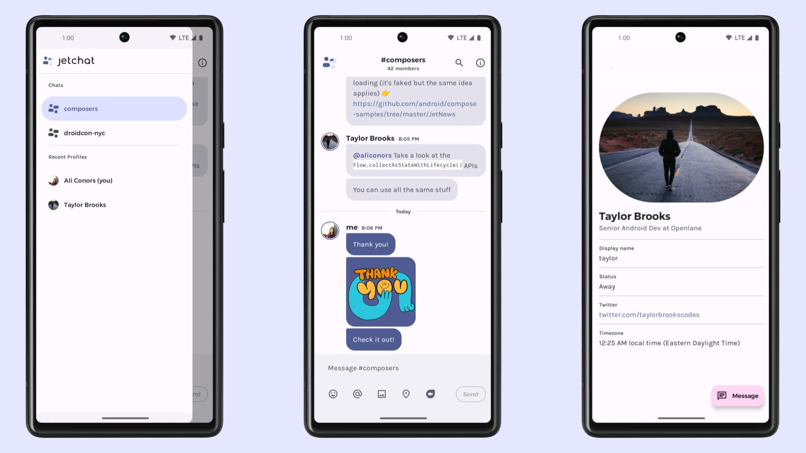

# Chat Compose Sample

Jetchat-style realtime chat sample backed by Supabase.

## UI preview




## Features

- Compose chat UI with bubbles and message composer
- Realtime incoming messages via Supabase Realtime
- Infinite scroll pagination for message history
- Send messages to Postgres-backed `chat_messages` table
- Room switching from Supabase-backed `chat_rooms`
- Anonymous-key chat with a display name, plus optional Supabase Auth identity
- Auth flows: email sign up/sign in, anonymous sign in, session restore, refresh, current user, JWT claim parsing, sign out
- Database flows: typed select/insert, raw CSV select, HEAD/count request, and RPC
- Realtime flows: Postgres insert subscription, broadcast, and presence tracking
- Storage flows: bucket lookup, upload, list, object info, exists, download, signed URL, public/authenticated URLs, remove
- Edge Functions flows: raw invoke and typed invoke

## Configure

Create or select a Supabase project, apply the SQL in `../../supabase/migrations/20240529_add_chat_tables.sql`, deploy the `hello-world` function if you want to use the Functions tab, then set these in `~/.gradle/gradle.properties` (or project `gradle.properties`):

```properties
SUPABASE_URL=https://your-project.supabase.co
SUPABASE_ANON_KEY=your-anon-key
SUPABASE_STORAGE_BUCKET=public
SUPABASE_FUNCTION_NAME=hello-world
```

For local development, start the Supabase CLI stack from the repository root and reset the database:

```bash
./gradlew supabaseAppDbReset
```

The Supabase CLI prints a local API URL and public client key after startup. Recent CLI versions label that key `Publishable`; older projects may call the same client-side value an `anon` key. Put that value in `SUPABASE_ANON_KEY`. When running on the Android emulator, use `http://10.0.2.2:<port>` instead of `http://127.0.0.1:<port>` for `SUPABASE_URL`. Docker or Colima must be running before the local stack can start.

The local `supabase/config.toml` enables email signup and anonymous sign-ins so every Auth tab action can be exercised in the sample stack.

For the Functions tab against the local stack, serve the function from another terminal:

```bash
supabase functions serve hello-world --no-verify-jwt
```

## Run

```bash
./gradlew :samples:chat-compose:installDebug
```

## SDK coverage

- **Auth tab:** email/password sign up and sign in, anonymous sign in, current user lookup, refresh, JWT claim parsing, and sign out.
- **Chat tab:** room lookup/creation, typed message insert/select, realtime Postgres insert subscription, broadcast, presence tracking, CSV/HEAD database diagnostics, and RPC message count.
- **Storage tab:** upload/list/inspect/remove against the configured bucket, including object info, exists, download, signed download URL, public URL, and authenticated URL.
- **Functions tab:** raw invoke and typed invoke against the configured Edge Function.

## Backend expectation

The included migration creates these tables and sample backend objects:

`chat_rooms`

- `id` (uuid)
- `name` (text)
- `created_at` (timestamptz)

`chat_messages`

- `id` (uuid)
- `room_id` (uuid, references `chat_rooms.id`)
- `sender_id` (uuid, nullable, references `auth.users.id`)
- `sender_name` (text)
- `body` (text)
- `created_at` (timestamptz)

Realtime

- `chat_messages` is added to the `supabase_realtime` publication so incoming inserts appear in the Chat tab.

`storage.buckets`

- `public` bucket, plus permissive sample policies for `storage.objects`

`public.chat_room_message_count(room uuid)`

- SQL RPC used by the Chat tab's `DB` button

The migration currently allows anon and authenticated read/write access so the sample works with only a project URL and anon key. Tighten those policies before using this schema in production.
